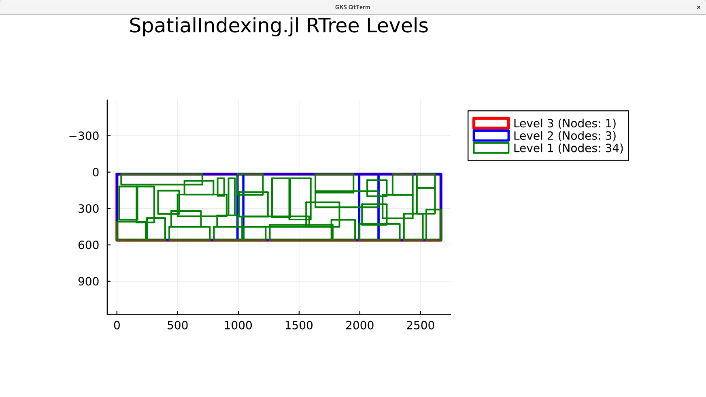
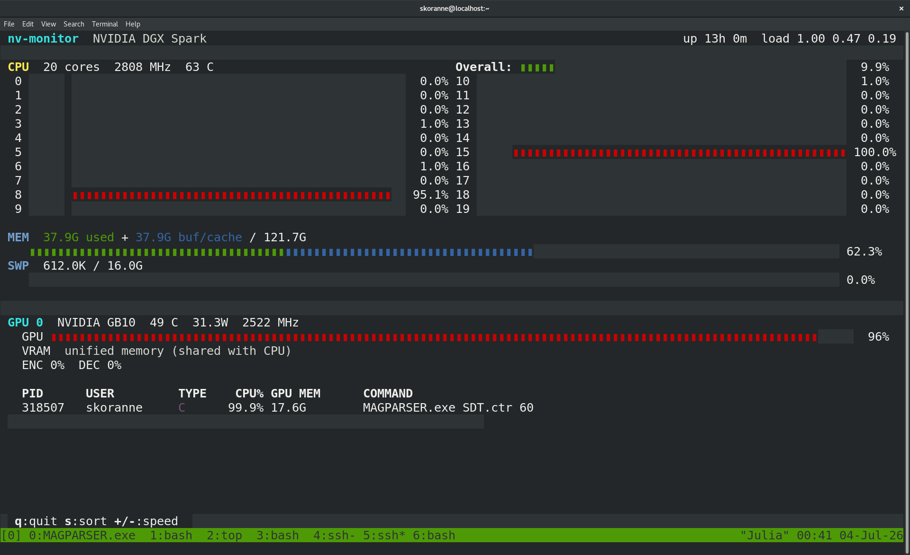
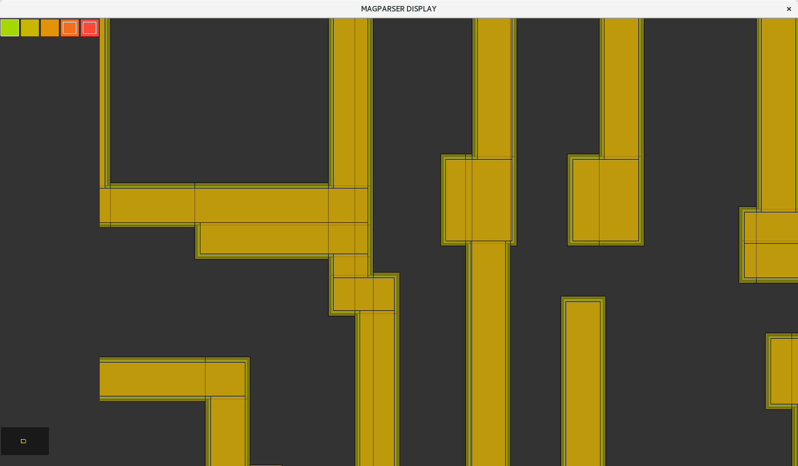
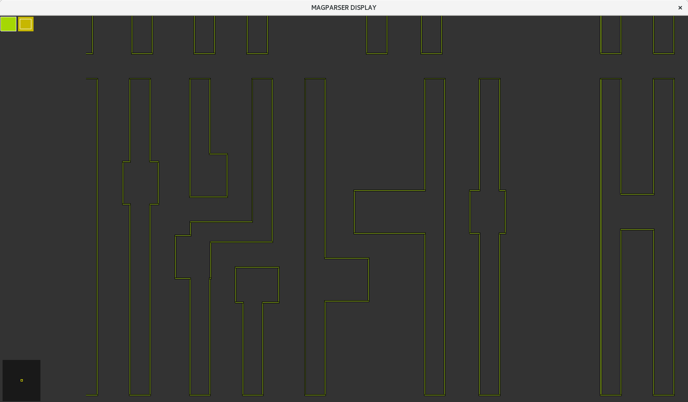

Performing research on optimal (?) spatial indexing structures, especially for hardware
deployment using Bitonic sort, RADIX networks.




```
# Control file for MAGPARSER
include(`./src/op_template.m4')dnl
program square
systeminfo
var temp_folder mkTempFolder
var abort_on_assert_zero 1
var temporary_layers 2
decl design d1 = INV.mag
decl output o1 = foo.mag
decl output o2 = bar.mag
decl memory f1 = nothing
decl memory t1 = nothing
info
exec init t1:nothing
RUN_LOOP(`OP1',`t1',`d1',`poly',`0.001',`li1',`0.001',`met1',`0.001',`met2',`0.001')dnl
dnl expands to
# Generating `t1',`d1',`poly',`0.001'
exec run t1:poly_1 = d1:poly GROW t1:nothing 0.001 0.001 0.001 0.001
exec run t1:poly_2 = d1:poly SIZE t1:nothing -0.001
exec run t1:poly_outer_ring = t1:poly_1 ~ d1:poly
exec run t1:poly_inner_ring = d1:poly ~ t1:poly_2
exec run t1:poly_ring_and1  = t1:poly_outer_ring * d1:poly
exec run t1:poly_ring_intersection  = t1:poly_outer_ring * t1:poly_inner_ring
exec run t1:nothing = t1:poly_ring_and1 ASSERT_ZERO t1:nothing
exec run t1:nothing = t1:poly_ring_intersection ASSERT_ZERO t1:nothing
flush
end 
```

Each OP1 does 4 operations: GROW, SHRINK, AND and NOT and checks these produce
expected results.


And here is an example with ~360 million boxes loaded.

